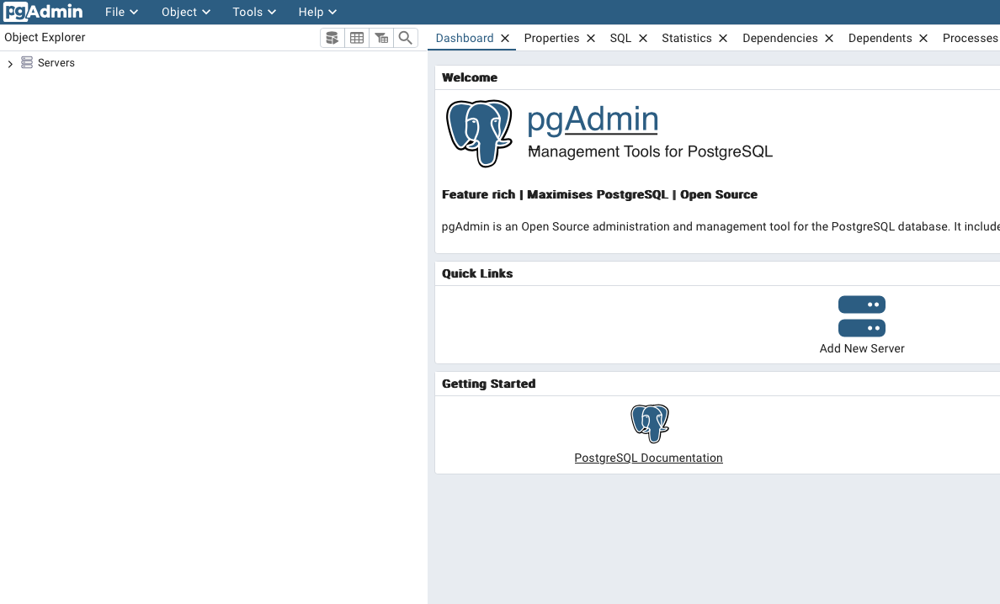
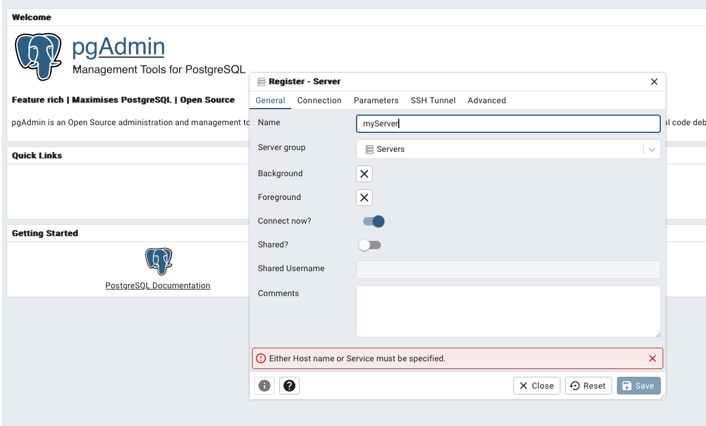
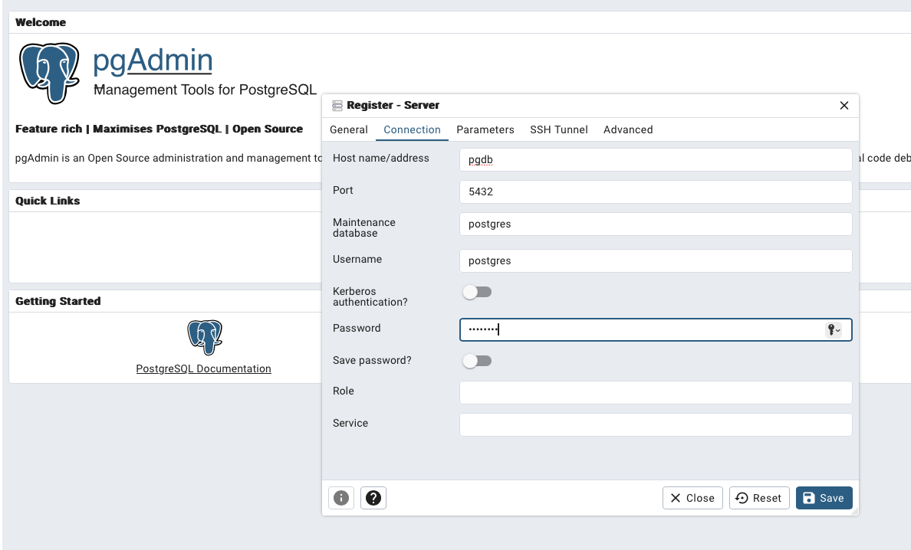
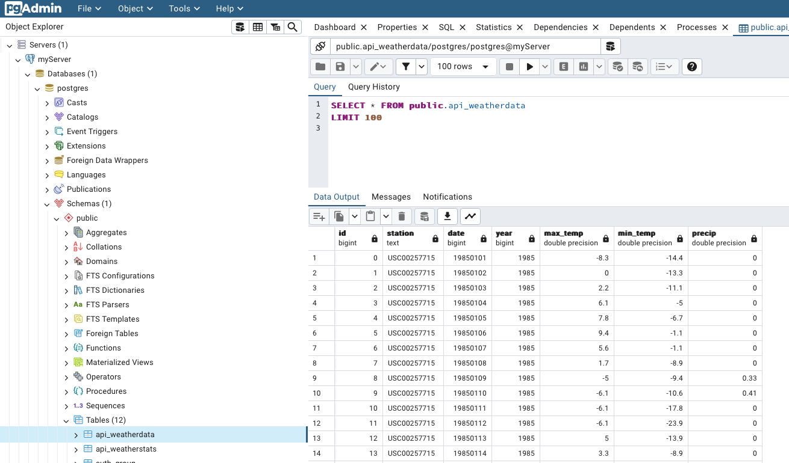
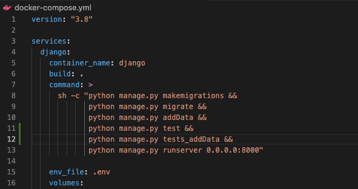
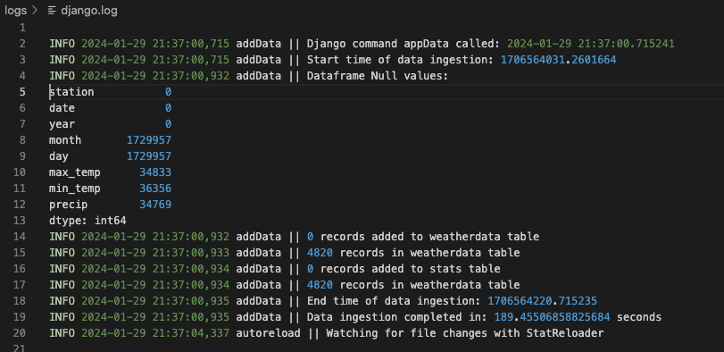
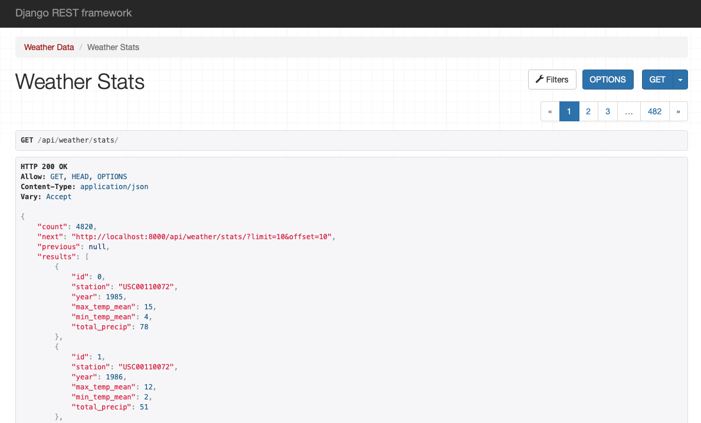
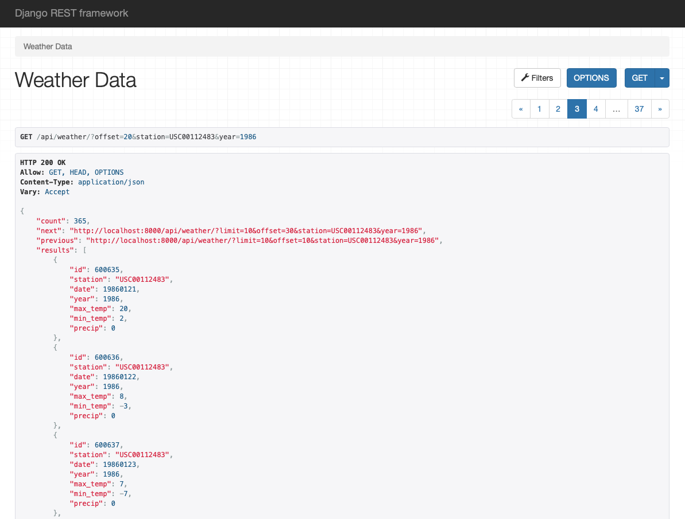
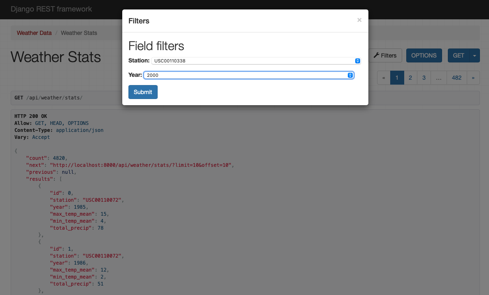
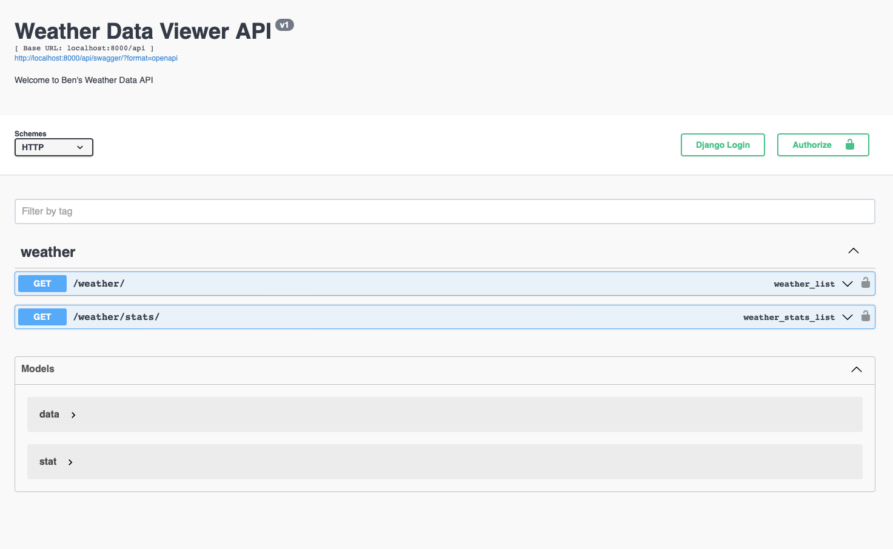

# Welcome to my weatherApp!

### Description:
Corteva Coding Challenge Exercise Solution

### Author: 
Ben Cooper

### Requirements:
Docker is installed and __running__ on your machine
 - [Docker desktop download and instructions can be found here](https://docs.docker.com/get-docker/)  
  
Git is installed on your machine
 - [Git download and instructions can be found here](https://git-scm.com/downloads)

### Implementation:  
Open a terminal and navigate to the directory you would like the project to be saved to.  
Clone the gitHub repo  

    git clone https://github.com/benjamin-j-cooper/weatherApp.git  

Navigate into the weatherApp's directory: 

    cd weatherApp  

If you are running the app for the first time:  

    docker-compose build  

Now, run the container (If you have already built the images, successive runs only need this command):  

    docker-compose up django

To stop and remove the container:

    docker-compose down  

**** NOTE ****  
If you would like to spin up a container with an image of pgadmin4 included (a postgres UI for interacting easily with the database) instead of "docker-compose up django", use: 

    docker-compose up  

Navigate to 

    http://localhost:5050  

Enter username (a@a.com) and password (a) 

Add a new server and setup:

Name it whatever you like: 

Host = pgdb, maintanance/username/password = postgres:

Now you can interact with the weather data and weather stats tables:

## Responses
### Problem 1 - Data Modeling
Database: Postgres  
Data model of weather data records: 

    class weatherData(models.Model):  
        id = models.AutoField(primary_key=True)  
        station = models.CharField(max_length=255)  
        date = models.IntegerField()  
        year = models.IntegerField()  
        max_temp = models.IntegerField()  
        min_temp = models.IntegerField()  
        precip = models.IntegerField()  

### Problem 2 - Ingestion  
Weather Data is ingested from raw .tsv files, transformed, and supplied into the postgres database using the custom management command "addData.py". This command is included in the docker-compose specification and run when the docker container is intialized:  

To speed up supplying the data to Postgres, addData first checks if the there is already data in the specified data model's table. If there is no data in the table, the data is bulk copied to the database.  
If there are existing records in the data model's table, an alternate method is used to check if each record already exists in the database. If it does not already exist, it is added. 

Logging for addData is implemented using django's built in logging. Log records including 'start time', 'end time', and the number of records added to the database are ouput to the log file logs/django.log  

### Problem 3 - Data Analysis
For every year, for every weather station: Average maximum temperature (in degrees Celsius), Average minimum temperature (in degrees Celsius), and Total accumulated precipitation (in centimeters) are calculated.
These calculations are done in the addData management command following data ingestion and prior to supplying the data to Postgres. Missing values are ignored by taking advantage of the 'skipna' parameter in pandas.groupby()  

    df.groupby(['station', 'year']).agg({'max_temp': ['mean'], 'min_temp': ['mean'], 'precip': ['sum']}, skipna=True).reset_index()  

The data model for the resulting stats data is:  

    class weatherStats(models.Model):  
        id = models.AutoField(primary_key=True)  
        station = models.CharField(max_length=255)  
        year = models.IntegerField()  
        max_temp_mean = models.IntegerField()  
        min_temp_mean = models.IntegerField()  
        total_precip = models.IntegerField()  

The same method 'insert_data_pgdb()' in addData.py is used to store both weather data and weather stats:  

    def insert_data_pgdb(self, dataframe, dataModel, engine):
        pgdb_table = dataModel._meta.db_table
        try:
            # Check if the database table is empty
            if dataModel.objects.count() == 0:
                #database table is empty. To speed up the ingestion, bulk insert all records.
                dataframe.to_sql(pgdb_table, if_exists='replace', con=engine, index=True,index_label='id')
                new_records = dataframe.shape[0]
                records_count = dataModel.objects.count()

                return records_count, new_records
            
            else:
                # Check if records already exist in the database
                existing_records = pd.read_sql_query(f'SELECT * FROM {pgdb_table}', engine)
                existing_keys = set(existing_records.apply(lambda row: self.generate_key(row, pgdb_table), axis=1))
                new_records = dataframe[~dataframe.apply(lambda row: self.generate_key(row, pgdb_table), axis=1).isin(existing_keys)]

                if not new_records.empty:
                    new_records.to_sql(pgdb_table, if_exists='append', con=engine, index=True, index_label='id')
                    new_records = len(new_records)
                    records_count = dataModel.objects.count()
                else:
                    new_records = 0
                    records_count = dataModel.objects.count()
                    
                return records_count, new_records
        except Exception as e:
            print(f"Error adding records to the database: {e}")
            logger.info(f"Error adding records to the database: {e}")

### Problem 4 - REST API
I used the Django REST framework and created a REST API with the following endpoints:  

    /api/weather  
    /api/weather/stats

Both endpoints return a JSON-formatted response with a representation of the ingested/calculated data in the database:  

Clients can navigate through returned records using the uncluded pagination feature:  

Additionally,  clients can filter the response by date and station ID using the custom filter tools (or a query string):  

Finally, I third endpoint provides automatic API documentation using the OpenAI specification:  

    /api/swagger

And tests are implemented in code (addData.py) and through django test cases implemented in the docker-compose specification: 

    api/tests/

### Extra Credit - Deployment
This project is not currently running in on AWS, however the approach I used of containerizing my django app with Docker was intentional and chosen to optimize deployment to AWS.  
There are several approaches that could be used to deploy this REST API to AWS; I would use AWS Elastic Beanstalk because it handles many of the more complex deployment details, is optimized for Docker containers, and has plenty of documentation. 
The next step in deploying this dockerized django REST API to AWS Elastic Beanstalk:
 - CI/CD: create gitHub actions.yml file to deploy docker image from gitHub to AWS account (alt: push Docker image to AWS from DockerHub)
 - Create Elastic Beanstak App: using AWSCLI or AWs Console